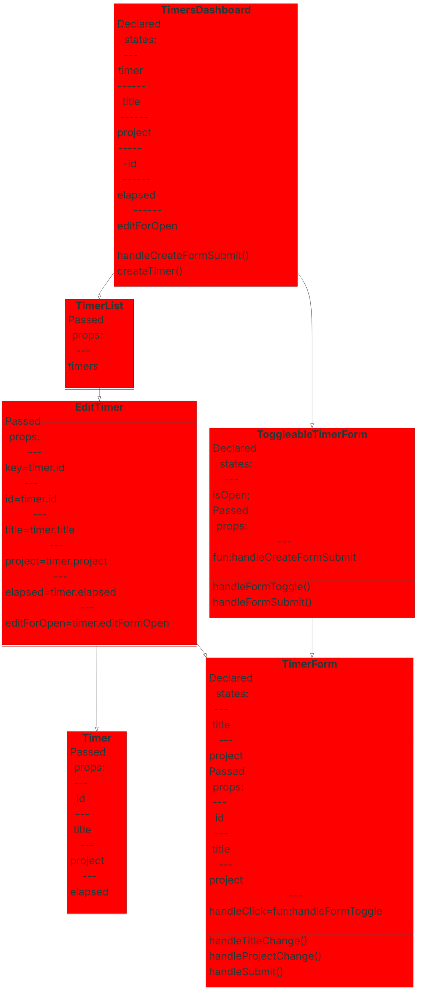

```mermaid
%%{init: {'theme': 'base', 'themeVariables': { 'fontSize': '40px', 'fontFamily': 'Inter', 'primaryColor': '#ff0000'}}}%%
  classDiagram
      TimersDashboard --|> TimerList
      TimersDashboard --|> ToggleableTimerForm
      TimerList --|> EditTimer
      ToggleableTimerForm --|> TimerForm
      EditTimer --|> Timer
      EditTimer --|> TimerForm
      
      class TimersDashboard{
      Declared states:
    	---timer
    	------title
    	------project
    	------id
    	------elapsed
    	------editForOpen
    	handleCreateFormSubmit()
    	createTimer()
      }
     
     class TimerList {
      	Passed props:
      	---timers
      }
     
     class ToggleableTimerForm {
     		Declared states:
        ---isOpen;
        Passed props:
        ---fun:handleCreateFormSubmit
        handleFormToggle()
        handleFormSubmit()
      }
     
     class EditTimer {
     	Passed props:
     	---key=timer.id
     	---id=timer.id
     	---title=timer.title
     	---project=timer.project
     	---elapsed=timer.elapsed
     	---editForOpen=timer.editFormOpen
      }
     
     class TimerForm{
     		Declared states:
     		---title
     		---project
				Passed props:
				---id
				---title
				---project
				---handleClick=fun:handleFormToggle
				handleTitleChange()
				handleProjectChange()
				handleSubmit()
      }
     
     class Timer {
     		Passed props:
     		---id
     		---title
     		---project
     		---elapsed
      }
```
