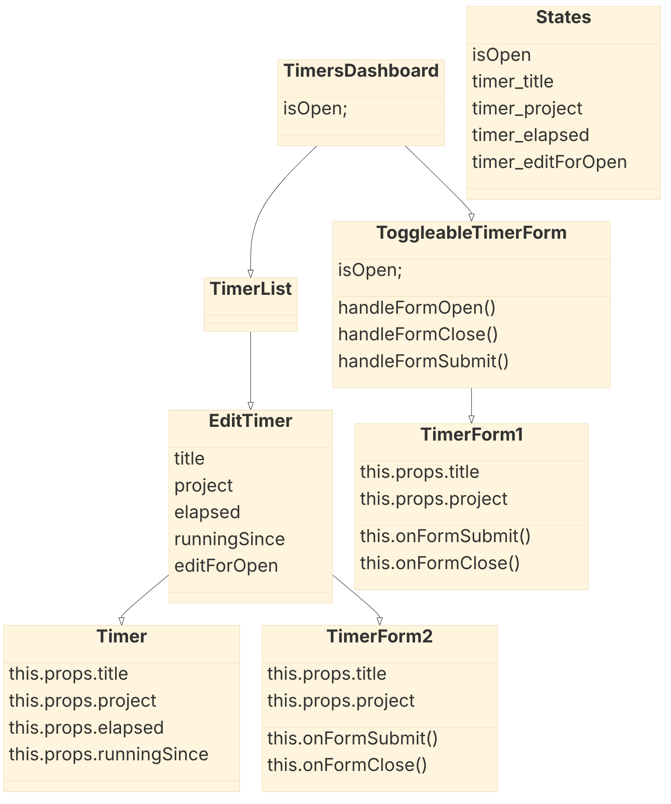

```mermaid
%%{
	init: {
		'theme': 'base', 
		'themeVariables': { 
			"fontSize": "40px", 
			'fontFamily': 'Inter'
			}
		}
	}%%
  classDiagram
      TimersDashboard --|> TimerList
      TimersDashboard --|> ToggleableTimerForm
      TimerList --|> EditTimer
      ToggleableTimerForm --|> TimerForm1
      EditTimer --|> Timer
      EditTimer --|> TimerForm2
      class TimersDashboard{
        isOpen;
      }
      class ToggleableTimerForm {
        isOpen;
        handleFormOpen()
        handleFormClose()
        handleFormSubmit()
      }
      class EditTimer {
      }
      class EditTimer {
        title
        project
        elapsed
        runningSince
        editForOpen
      }
      class TimerForm1 {
        this.props.title
        this.props.project
        this.onFormSubmit()
        this.onFormClose()
      }
      class TimerForm2 {
        this.props.title
        this.props.project
        this.onFormSubmit()
        this.onFormClose()
      }
      class Timer {
        this.props.title
        this.props.project
        this.props.elapsed
        this.props.runningSince
      }

  class States{
    isOpen
    timer_title
    timer_project
    timer_elapsed
    timer_editForOpen
  }
```
